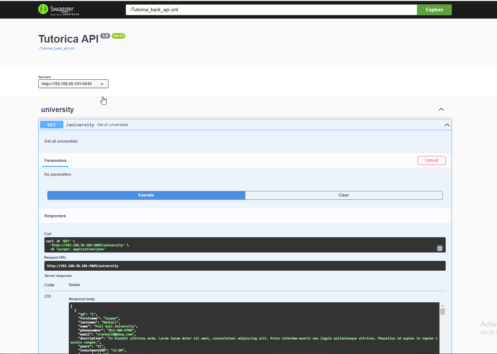

# Tutorica

Tutorica is a test project for developing test automation scripts on C# and .NET

## Requirements

For raising up the project we need to have:

1. Microsoft SQL Server (2017 or higher)
2. Docker

   
3. Microsoft DOTNET6
4. Newman (for API testing)

Tutorica is a cross-platform solution and can be run on Linux, MacOS, and Windows

## How to deploy the solution

### Database preparing

1. Create Database "Tutorica"
2. Execute SQL-script TutoricaBack/sql_scripts/mssqlserver/items_create_table.sql
3. Execute SQL-script TutoricaBack/sql_scripts/mssqlserver/dbo.items.sql

### Mocking

As a mock system we use Wiremock for running Wiremock: Go to TutoricaBack/wiremock and run start_wiremock_script.sh

### API Documentation

As an API Doc server, we use Swagger for running Swagger: Go to TutoricaBack/swagger and run start_swagger_script.sh

## How to run the solution

### Running Back API Server

Set MS SQL Server parameters in database_configuration.json You can keep parameters in database_sqlite3_configuration.json as is Set Wiremock parameters in external_services.json

Go to TutoricaBack and execute: dotnet run -project ./TutoricaBack/TutoricaBack.csproj --urls [http://0.0.0.0:5045](http://0.0.0.0:5045/) Or You can run the solution in VSCode via a Terminal task "Run Back"

### Running Front

Set a Back API Server address in TutoricaFront/wwwroot/appsettings.json

Go to TutoricaFront and execute: dotnet run -project ./TutoricaFront/TutoricaFront.csproj --urls [http://0.0.0.0:5044](http://0.0.0.0:5044/) Or You can run the solution in VSCode via a Terminal task "Run Front"

## Testing

The project has Smoke tests in the MS Excel file Tutorica_E2E_Smoke_TS.xlsx inside the solution

### API testing Postman/Newman

API tests for Postman are contained in api_requests directory Before running set environment parameters in "Dev Environment.postman_environment.json" You can run a collection via Postman Or You can run it via Newman with the help of the script run_newman_test.sh in api_requests directory

### GUI testing Automa

Automa tests are contained in TutoricaE2ETests/AutomaScripts

### GUI testing Selenium

For running Selenium tests

Set up edgedriver on your system (or driver for any of your favorite browser) in ".driver" directory Modify UnitTest1.cs for your Front-server address (and your driver if you've changed) Run GUI/Selenium tests via command: dotnet test

